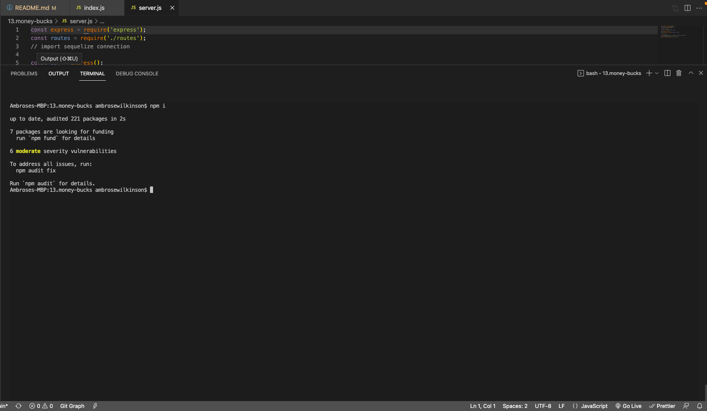
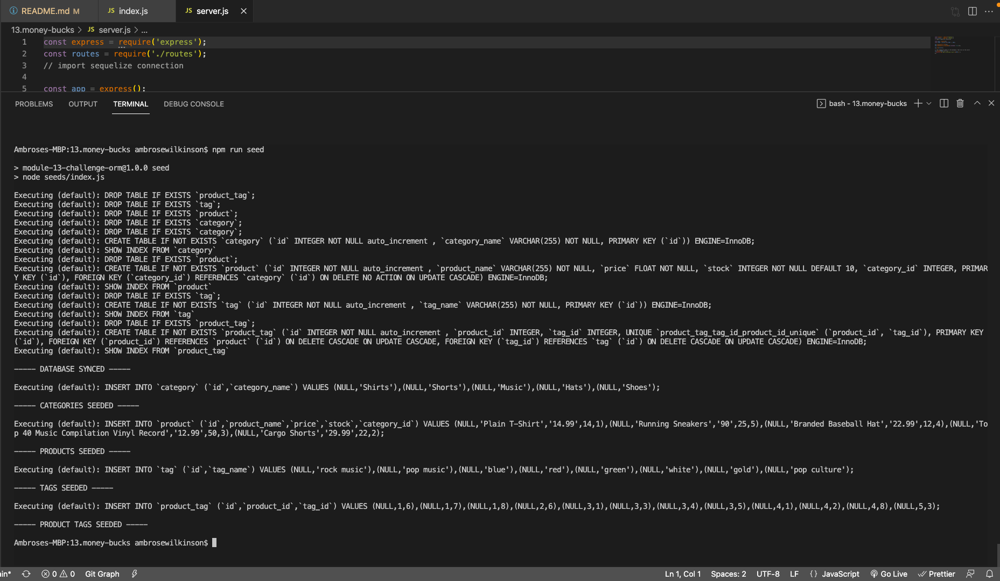
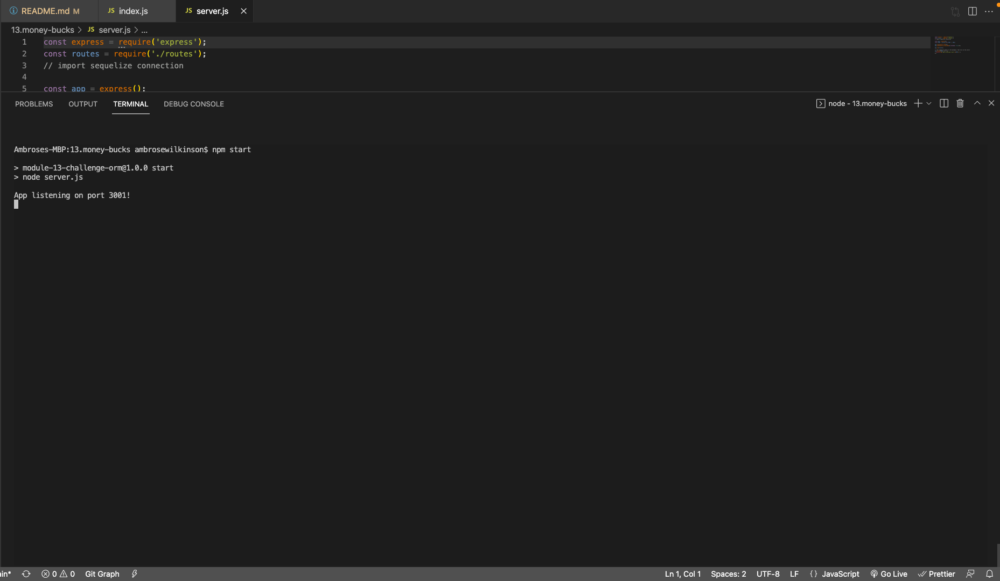
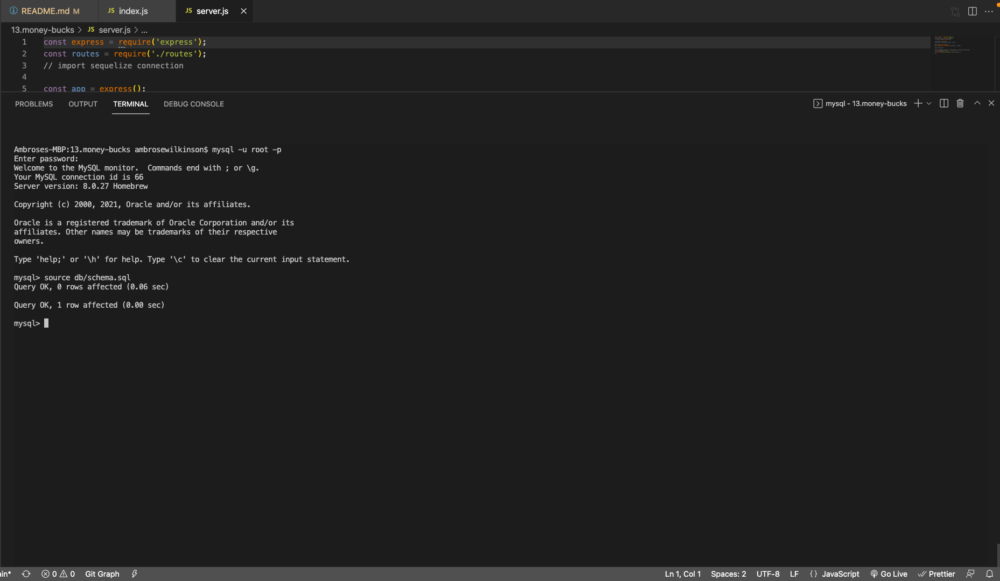

# Money-Bucks E-Commerce Back End 

In this age of internet marketplace everyone and their mother wants their own E-Commerce platform. Presented here is Money Bucks, the learn, mean back-end to power your budding business's products, catagories, and tags!
  
## Description

Money Bucks uses Express.js and the Sequelize ORM to allow users to go through their catalogue of products, categories, and tags to organize their goods and give users a straight forward way to search for good!

Products have been organized by id, product name, price, stock, tag id (which references multiple tags), and category id (which references the category).

Categories relate to products. Users can create whatever categories they theink best matches their products.

Tags have been simply organized by tag name with will reference the product.

GitHub Repo: [Money Bucks](https://github.com/a-breezy/money-bucks)

## Table of Contents

  * [Installation](#installation-instructions)
  * [Usage](#usage)
  * [License](#license)
  * [Collaborators](#collaborators)
  * [How to Contribute](#how-to-contribute)
  * [Tests](#tests)
  * [Questions](#questions)

## Installation Instructions

Install all npm dependencies: type 'npm i'

Make sure to create database in mysql, by starting mysql in the terminal with and typing:
  'source db/schema.sql'

There is are seed files (/seeds/seeds) which can be sourced using the following command:
  'npm run seed'

Start the server by typing:
  'npm start'

From here routes can be tested.

---
## Usage

A Video of Money Bucks can be found [here](https://drive.google.com/file/d/1g091nc52SSXMCliNK_ki8cEMr1YSu0fh/view)

*Installing Package*

*Seeding Database*

*Starting Server*

*Creating Database Schema*

---
## License

  [License: MIT](https://opensource.org/licenses/MIT)
  

---
## Collaborators

None

---
## How to Contribute

None

---
## Tests

None

---
## Questions

ambrose.wilkins@gmail.com
